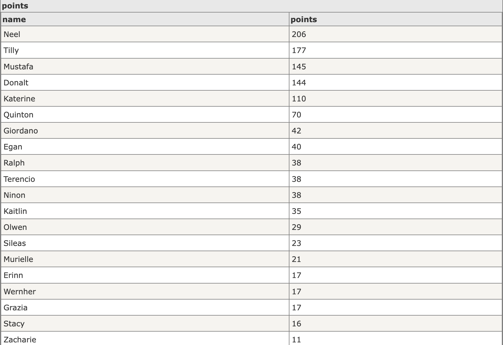
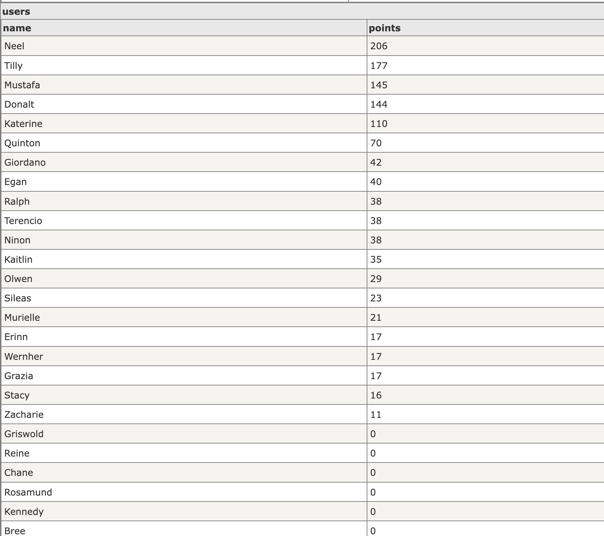
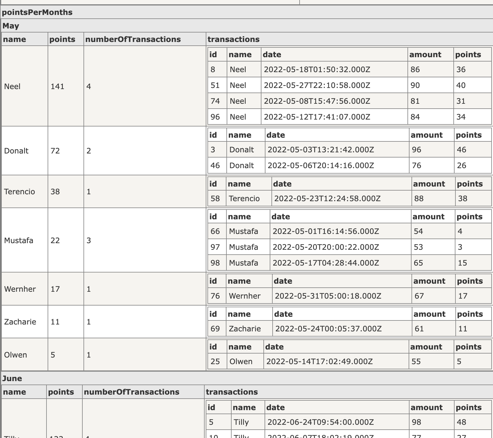

[](http://expressjs.com/)

  Fast, unopinionated, minimalist web framework for [node](http://nodejs.org).

  [![NPM Version][npm-version-image]][npm-url]
  [![NPM Install Size][npm-install-size-image]][npm-install-size-url]
  [![NPM Downloads][npm-downloads-image]][npm-downloads-url]


## Installation

```console
$ npm install
```

Follow [our installing guide](http://expressjs.com/en/starter/installing.html)
for more information.


### Quick Start


```console
$ cd /test-task
```

  Install dependencies:

```console
$ npm install
```

  Start the server:

```console
$ npm start
```

  View the website at: http://localhost:3000


### End Point

`http://localhost:4000/v1/points`

```console
  curl 'http://localhost:4000/v1/points'
```

### Test

```
$ npm run test
```

###  Screenshots
If you want to preview the json in tables please use this tool http://json2table.com/ 

**Points**


**Users**


**Points Per User**

